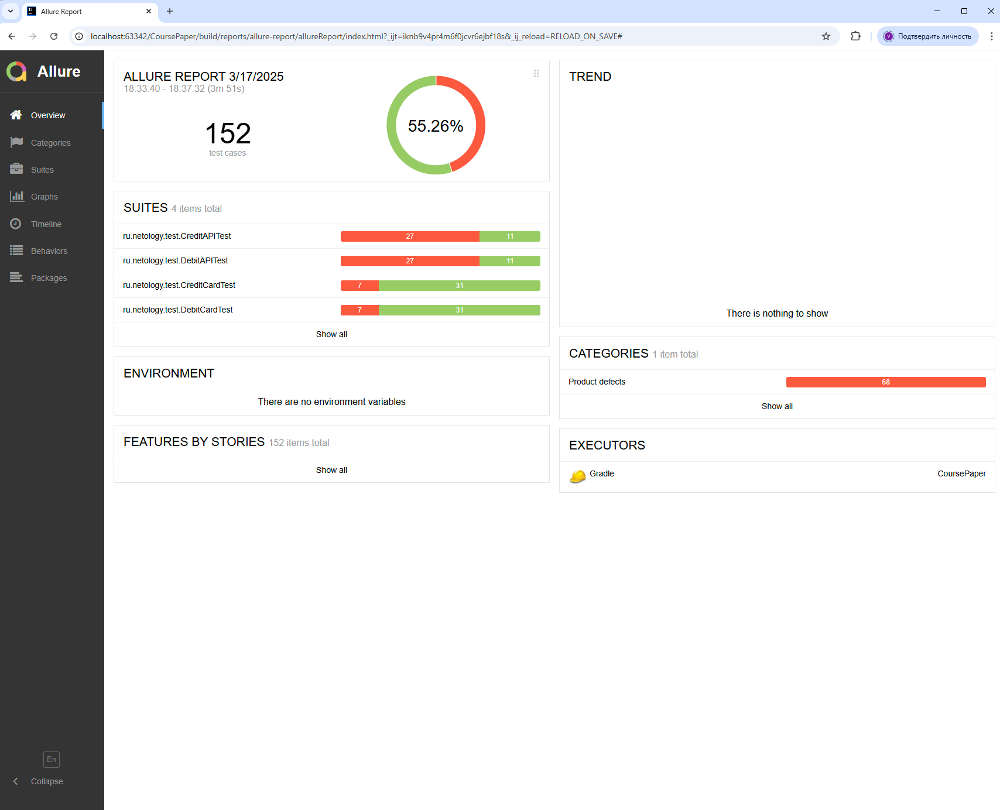

# Отчет о тестировании веб-сервиса для приобретения путевок

## Краткое описание

07.03.25 - 18.03.25 было проведено автоматизированное тестирование веб-сервиса для приобретения путевок с онлайн-оплатой или оплатой в кредит.

В ходе проверки были проведены тесты UI, API, тестирование записи в БД.

## Количество тест-кейсов

**Всего было проведено 152 теста.**
- **38 авто-теста и 38 API тестов** - для оплаты по дебетовой карте;
- **38 авто-теста и 38 API тестов** - для оплаты с помощью выдачи кредита по данным банковской карты;

**Успешных: 84 (55.26%);**

**Не успешных: 68 (44.73%);**

### **Отчет по результатам тестирования:**

По итогам сформирован отчет с использованием Allure Report.

По результату тестирования, были выявлены баги, о чем заведены баг-репорты
с описанием выявленных дефектов и оформлены в разделе [Issues](https://github.com/vladi166/CoursePaper/issues)

**Общие рекомендации**

1.	Устранить обнаруженные дефекты
2. Добавить CSS селекторы для тестирования
3. Разработать документацию на БД.
4. Установить валидацию полей при передаче данных в БД.